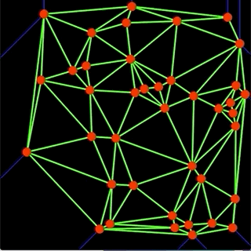

# Kinetic Delaunay Triangulation

> An event-based algorithm to maintain Delaunay Triangulations for **moving points**



## Dependencies
googletest (already in the codebase), CMake, OpenCV, Eigen

Tested on Ubuntu16.04 and macOS 10.14.5

### CMake >= 3.15
```$xslt
(ubuntu 16.04)
wget -O /opt https://github.com/Kitware/CMake/releases/download/v3.15.7/cmake-3.15.7.tar.gz 
chmod +x /opt/cmake-3.15.7.sh
sudo bash /opt/cmake-3.15.7.sh
sudo ln -s /usr/local/bin/cmake /usr/bin/cmake
cmake --version
```

### OpenCV >= 4.2
```
(ubuntu 16.04, see https://docs.opencv.org/trunk/d7/d9f/tutorial_linux_install.html)
```

```$xslt
(macOS 10.14.5)
brew install opencv
```

### Eigen >= 3.3.7
```$xslt
(ubuntu 16.04)
sudo apt install libeigen3-dev
```

```$xslt
(macOS 10.14.5)
brew install eigen
```

## Build
`mkdir build && cd build && cmake .. && make -j 8`

## Run
(Under `./build/bin` directory)
1. Run the unit-test: `./test_kinetic_delaunay`
2. Run the demo: `./kinetic-delaunay `
